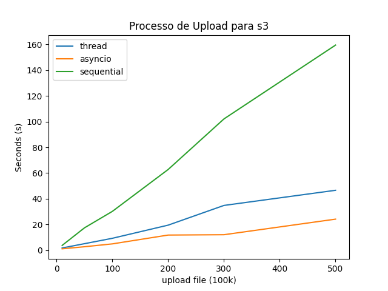

# Formas de concorrência em python

Foi feito uma comparação entre concorrência utilizando thread's reais, e utilizando corrotinas, atráves da biblioteca [asyncio](https://docs.python.org/3/library/asyncio.html).

Para fazer a comparação dos dois métodos, foi utilizando a situação onde é decompactado um arquivo zip, com uma determinada quantidade de arquivos, e feito upload de todos os arquivos para um banco de dados semi-estruturado, que no caso, foi o serviço s3 da aws. Ou seja, trata-se de um experimento onde maior parte do tempo é gasto em tarefas de IO, que é um caso também chamado de IO-Bound.

Para criar corrotinas utilizando a sintaxe `async/await` é importante que as bibliotecas utilizadas suportem asyncronia, com isso, para fazer upload na versão que utiliza asyncronia foi utilizado a biblioteca [aiobotocore](https://github.com/aio-libs/aiobotocore) que é a versão asyncrona do botocore. 

## Resultados

O processo de upload foi feito para três métodos diferentes, primeiro para forma sequencial, onde o upload dos arquivos é feito um atrás do outro. A outra técnina é utilizando threads, onde cada upload de arquivo é feito em um thread separada de forma concorrente. Note que essas threads apenas acessam um core da maquina, devido a limitação do [GIL](https://wiki.python.org/moin/GlobalInterpreterLock). 

A ultima versão utiliza conceitos de asincronia, com a biblioteca `asyncio`, onde cada upload é feito em uma corrotina que têm capacitade de susperedem sua execução utilizando `await` e de serem concorrentes, através de um thread que executa um event loop.

Abaixo é mostrado o tempo utilizado para fazer upload de uma determinada quantidade de arquivos. Note que para fazer upload de 500 arquivos de 100k cada, a versão asincrona utilizou cerca de 20s, enquanto a versão com thread's utilizou por volta de 40s, quase o dobro. Sem dúvidas, a versão sequencial foi a pior de todas, que gastou  mais de minutos.



O leitor pode se perguntar porque houve esse ganho de performance sobre a versão asincrona, eis aqui algumas vantagens que a versão asincrona oferece sobre a versão com thread's:

 - O custo de criar uma thread é bem mais caro que criar um corrotina que pode ser executada de forma concorrente.
 - Para haver concorrencia utilizando threads em um único core, o sistema operacional faz o processo de alternar o acesso a CPU entre as threads, nesse processo as threads não têm ciência de que isso acontece, pois é feito a nivel de sistema operacional, esse processo é conhecido como *preemptive scheduling*. Já na versão asincrona, o processo de alternância é feito a nivel de aplicação de forma cooperativa(utilizando a sintaxe `await`), assim a concorrência entre as corrotinas é feita de forma mais eficaz. Esse processo é conhecido como *cooperative scheduling*.

Uma desvantagem de utilizar asincronia em python é que essa feature é relativamente nova, com isso, muitas tarefas podem não possuir uma biblioteca que suporte asincronia. Ou se possuir, é possível ter uma documentação menos rica.

## Como reproduzir

É necessário criar um ambiente vitual utilizando a biblioteca `venv`, após isso é necessário instalar todas as bibliotecas descritas no requirements. Ademais, deve-se criar um arquivo `.env` com as variáveis de ambiente descritas em `.env.example`. Com isso, o ambiente está pronto.

Com o ambiente pronto, é necessário criar o arquivo zip para fazer upload. É utilizado esse comandos:

```
make create-zip FILES_IN_ZIP=500
```

Nesse caso é criado um arquivo zip com 500 arquivos de 100KB cada. 

Agora para executar o experimento pode se utilizar o comando:

```
make asyncio-exec && make thread-exec && make sequential-exec
```

Com isso, é executado o experimento nas três diferentes formas. O resultado com tempo de cada uma é salvo em um arquivo `.csv`.

Após fazer o experimento algumas vezes, com diferentes quantidades de arquivos, para ver o resultado de forma gráfica, utilize o comando:

```
make show-plot
```

## Contribuições

Qualquer forma de contribuição é bem-vinda, basta abrir um issue ou PR. Obrigado :rocket:


